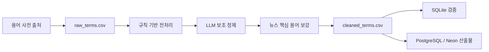

# 주식 용어 사전 파이프라인

국내 주식 뉴스 큐레이션 서비스에서 툴팁으로 사용할 주식 용어 사전을 구축하는 파이프라인입니다.

수집한 금융 용어를 전처리하고, LLM 보조 정제로 카테고리 분류·설명 정규화·중복/별칭 판단·출처 충돌 해결·뉴스 핵심 용어 보강을 수행한 뒤 SQLite 검증본과 Neon/PostgreSQL 업로드 산출물을 생성합니다.

## Neon PostgreSQL 구조

Neon에는 단일 테이블 `stock_terms`로 용어 사전을 저장합니다. 툴팁 조회에 필요한 필드만 포함하고, LLM 판단 메모나 검수 사유는 최종 DB에 저장하지 않습니다.

| 컬럼 | 설명 |
| --- | --- |
| `term` | 대표 용어 |
| `aliases` | 별칭 목록, PostgreSQL에서는 `JSONB` 사용 |
| `category` | 용어 카테고리 |
| `definition` | 서비스용 설명 |
| `source_name` | 대표 출처명 |
| `source_url` | 대표 출처 URL |

Neon 반영 절차는 [Neon 업로드 절차 문서](docs/upload_to_neon.md)를 참고합니다.

## 현재 상태

현재 최종 산출물 기준:

| 항목 | 값 |
| --- | ---: |
| 수집 파이프라인 수집 용어 | 1,709 |
| 최종 DB 반영 용어 | 1,447 |

## 아키텍처



파이프라인은 세 층으로 나뉩니다.

- `stock_dictionary/`: 수집, 전처리, LLM, export 도메인 로직
- `scripts/`: CLI 실행 진입점
- `data/`, `output/`: 검증 가능한 데이터 산출물

최종 DB는 단일 테이블 중심 구조입니다. LLM 판단 메모나 검수 사유는 최종 DB 컬럼에 넣지 않고 중간 CSV 로그에만 남깁니다.

## 저장소 구조

```text
.
├── stock_dictionary/              # 파이프라인 공용 모듈
│   ├── models.py                  # CSV 행 계약
│   ├── augmentation.py            # 뉴스 핵심 용어 보강 검증/병합
│   ├── preprocess.py              # 정규화, 카테고리 게이트
│   ├── scrapers.py                # Scrapling 기반 수집기
│   ├── llm_pipeline.py            # LangChain JSON/Pydantic LLM 작업
│   └── exporters.py               # SQLite, PostgreSQL 산출물 생성
├── scripts/
│   ├── run_pipeline.py            # 규칙 기반/스모크 파이프라인
│   ├── run_llm_samples.py         # LLM 단계별 실행기
│   └── build_final_artifacts.py   # 최종 CSV/SQLite/PostgreSQL 조립
├── prompts/                       # 작업별 LLM 프롬프트
├── tests/                         # pytest 테스트
├── data/
│   ├── raw_terms.csv              # 수집 원천 데이터
│   ├── cleaned_terms.csv          # 최종 DB 입력 데이터
│   ├── term_augmentation_seed.csv # 사람이 관리하는 필수 보강 시드
│   ├── review_required_terms.csv  # 검수 후보
│   ├── category_excluded_terms.csv
│   └── llm_full/                  # 전체 LLM 실행 로그
├── output/
│   ├── stock_dictionary.sqlite
│   ├── schema.postgres.sql
│   ├── seed_terms.csv
│   └── seed_terms.sql
├── docs/
│   ├── stock_dictionary_prd.md
│   ├── upload_to_neon.md
│   └── migration_to_neon.md
├── Agent.md
├── pyproject.toml
└── uv.lock
```

## 기술 스택

| 구분 | 기술 | 버전/비고 |
| --- | --- | --- |
| 런타임 | Python | 3.12 |
| 패키지 관리 | uv | `uv.lock` 기반 |
| 웹 수집 | Scrapling | 0.4.8 |
| LLM 오케스트레이션 | LangChain | 1.2.18 |
| LLM 코어 | LangChain Core | 1.4.0 |
| 그래프 실행 | LangGraph | 1.1.10 |
| Gemini 연동 | langchain-google-genai | 4.2.2 |
| 데이터 검증 | Pydantic | 2.13.4 |
| 테스트 | pytest | 9.0.2 |
| 로컬 검증 DB | SQLite | `output/stock_dictionary.sqlite` |
| 배포 대상 DB | Neon/PostgreSQL | `JSONB` aliases 사용 |

## 실행 환경

의존성 설치:

```bash
uv sync
```

`.env.example`을 기준으로 `.env`를 작성합니다.

주요 환경변수:

| 변수 | 용도 |
| --- | --- |
| `GEMINI_API_KEY` | Google Gemini API 인증 |
| `MAIN_MODEL` | 기본 LLM 모델 |
| `FALLBACK_MODEL` | 기본 모델 실패 시 사용할 보조 모델 |
| `CATEGORY_ASSIGNMENT_THINKING_LEVEL` | 카테고리 분류 단계 추론 수준 |
| `DUPLICATE_ALIAS_JUDGMENT_THINKING_LEVEL` | 중복/별칭 판단 단계 추론 수준 |
| `DEFINITION_REWRITE_THINKING_LEVEL` | 정의 재작성 단계 추론 수준 |
| `SOURCE_CONFLICT_RESOLUTION_THINKING_LEVEL` | 출처 충돌 해결 단계 추론 수준 |
| `LANGSMITH_TRACING` | LangSmith tracing 활성화 여부 |
| `LANGSMITH_ENDPOINT` | LangSmith API endpoint |
| `LANGSMITH_API_KEY` | LangSmith API 인증 |
| `LANGSMITH_PROJECT` | LangSmith 프로젝트 이름 |

`.env`는 git에 포함하지 않습니다.

## 사용법

기존 `data/raw_terms.csv`를 기준으로 규칙 기반 파이프라인 실행:

```bash
uv run python scripts/run_pipeline.py --mode existing
```

전체 LLM 정제 단계 실행:

```bash
uv run python scripts/run_llm_samples.py --task category_assignment --parallelism 100 --data-dir data --output-dir data/llm_full
uv run python scripts/run_llm_samples.py --task duplicate_alias_judgment --parallelism 100 --data-dir data --output-dir data/llm_full --input-csv data/llm_full/category_assignment_results.csv
uv run python scripts/run_llm_samples.py --task definition_rewrite --parallelism 100 --data-dir data --output-dir data/llm_full --input-csv data/llm_full/category_assignment_results.csv
uv run python scripts/run_llm_samples.py --task source_conflict_resolution --parallelism 100 --data-dir data --output-dir data/llm_full --input-csv data/llm_full/definition_rewrite_results.csv --raw-csv data/raw_terms.csv
uv run python scripts/run_llm_samples.py --task term_augmentation --parallelism 1 --data-dir data --output-dir data/llm_full --input-csv data/llm_full/definition_rewrite_results.csv --seed-csv data/term_augmentation_seed.csv --max-extra-terms-per-category 5
```

LLM 결과를 기준으로 최종 산출물 생성:

```bash
uv run python scripts/build_final_artifacts.py --samples-dir data/llm_full --data-dir data --output-dir output
```

검증:

```bash
uv run pytest -q
```

## 산출물

| 파일 | 용도 |
| --- | --- |
| `output/stock_dictionary.sqlite` | SQLite 검증본 |
| `output/schema.postgres.sql` | Neon/PostgreSQL 테이블 생성 SQL |
| `output/seed_terms.csv` | Neon/PostgreSQL 기본 적재 CSV |
| `output/seed_terms.sql` | CSV 적재가 어려운 경우 사용할 보조 SQL |
| `docs/upload_to_neon.md` | Neon 업로드 절차 문서 |
| `docs/migration_to_neon.md` | SQLite 검증 결과를 Neon으로 이관하는 기준 문서 |
| `docs/stock_dictionary_prd.md` | 주식 용어 사전 구축 요구사항 문서 |
| `data/review_required_terms.csv` | 자동 반영하지 않은 검수 후보 |
| `data/category_excluded_terms.csv` | 카테고리 게이트에서 제외한 항목 |
| `data/llm_full/*.csv` | 전체 LLM 단계별 실행 로그 |
